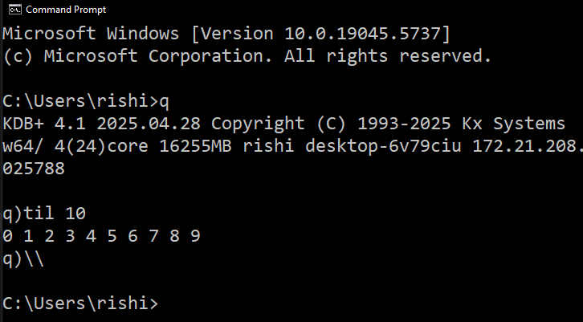

# KDB Notes

My notes on KDB/Q

## Q For Mortals

> My notes on the book "Q for Mortals" by Jeffry Johnston.

[Q For Mortals](https://code.kx.com/q4m3/)

## Table of Contents

1. [Q Shock and Awe](https://github.com/backstreetbrogrammer/59_KDB_Notes?tab=readme-ov-file#1-q-shock-and-awe)
2. [Basic Data Types: Atoms]()

---

## 1. Q Shock and Awe

KDB Database is a high-performance, columnar, time-series database developed by Kx Systems.

It is widely used in industries like finance, telecommunications, and utilities for handling large volumes of real-time
and historical data.

KDB is built around the **q programming language**, which is a concise, expressive, and functional language designed for
querying and analyzing data efficiently.

**Key Features of KDB:**

- **Columnar Storage**: Optimized for analytical queries, especially on time-series data.
- **Time-Series Focus**: Designed to handle high-frequency data, such as stock market tick data.
- **In-Memory Processing**: Supports in-memory operations for ultra-fast data access and computation.
- **q Language**: A powerful query language for data manipulation and analysis.
- **Scalability**: Handles terabytes to petabytes of data efficiently.
- **Real-Time and Historical Data**: Combines real-time streaming data with historical data for analysis.

**Benefits of KDB:**

- **High Performance**: Optimized for speed, making it ideal for real-time analytics and high-frequency trading.
- **Compact Syntax**: The q language allows for concise and expressive queries, reducing development time.
- **Efficient Storage**: Columnar storage reduces disk I/O and improves query performance.
- **Time-Series Analysis**: Built-in support for time-series operations like aggregation, joins, and windowing.
- **Scalability**: Can scale horizontally and vertically to handle massive datasets.
- **Interprocess Communication (IPC)**: Enables distributed computing and integration with other systems.
- **Flexibility**: Supports structured, semi-structured, and unstructured data.
- **Integration**: Easily integrates with other programming languages (e.g., Python, C++, Java) and tools.

KDB is particularly popular in financial services for tasks like algorithmic trading, risk management, and market data
analysis due to its ability to process large datasets in real time.

### 1.1 Starting q

[Installation](https://code.kx.com/q/learn/install/)

After installation, launch CMD and issue the following commands:

```cmd
setx QHOME "C:\q"
setx PATH "%PATH%;C:\q\w64"
```

Type `q` to start the q interpreter.



### 1.2 Variables

Declaring a variable and assigning its value are done in a single step with the operator `:` which is called **amend**
and is read **"is assigned"** or **"gets"**.

```q
q)a:42
```

A variable name must start with an alphabetic character, which can be followed by alpha, numeric or underscore.

### 1.3 Whitespace

In general, q permits, but does not require, whitespace around operators, separators, brackets, braces, etc.

### 1.4 The Q Console

The q console evaluates a q expression that you enter and echoes the result on the following line.

An exception to this is the assignment operation that has a return value, even though the console does not echo it.

However, we can use **"show"** to display the value of a variable.

```q
q)show a:42
42
```

### 1.5 Comments

The forward-slash character `/` indicates the beginning of a comment.

At least one whitespace character must separate `/` intended to begin a comment from any text to the left of it on a
line.

### 1.6 Assignment

Dynamic assignment is done with the `:` operator.

In the following example, the variable a is not referenced after it is assigned. Instead, the value of the assignment is
propagated onward – i.e., to the left.

```q
q)b:1+a:42
q)b
43
```

### 1.7 Order of Evaluation

The order of evaluation is from right to left.

Because the interpreter always evaluates expressions right-to-left, programmers can safely read q expressions
left-to-right.

### 1.8 Data Types 101

The basic data types are:

- **long**: 64-bit signed integer
- **float**: 8-byte floating point number
- **boolean**: single byte => `1b` as true, `0b` as false
- **date**: number of days since the millennium, positive for post and negative for pre
- **timespan**: number of nanoseconds since midnight

Division is denoted as `%` as `/` is used for comments.

Division always results in a float.

```q
q)2000.01.01 / this is actually 0
2000.01.01
q)2014.11.19 / this is actually 5436
2014.11.19
q)1999.12.31 / this is actually -1
1999.12.31
q)12:00:00.000000000 / this is noon
0D12:00:00.000000000
q)2000.01.01+5
2000.01.06
q)2000.01.01=0
1b
q)12:00:00.000000000=12*60*60*1000000000
1b
```

**Symbols**

A symbol is a string of characters that begins with a back-quote character **`** and is followed by one or more
alphanumeric.

```q
q)`aapl
_
q)`jab
_
q)`thisisareallylongsymbol
_
q)`aapl=`apl
0b
```

### 1.9 Lists 101

A list is a collection of items, which can be of any type.

The notation for a general list encloses items with `(` and `)` and uses `;` as separator.

Spaces after the semicolons are optional but can improve readability.

```q
q)(1; 1.2; `one)
1
1.2
`one
```

In the case of a homogenous list of atoms, called a simple list, q adopts a simplified format for both storage and
display.

The parentheses and semicolons are dropped.

```q
q)(1; 2; 3)
1 2 3

q)(1b; 0b; 1b)
101b

q)(`one; `two; `three)
`one`two`three
```

**Using til**

The til operator `til` creates a list of integers starting from `0` up to, but not including, the specified number.

Be mindful that q always evaluates expressions from **right to left** and those operations work on vectors whenever
possible.

```q
q)til 10
0 1 2 3 4 5 6 7 8 9

q)1+til 10
1 2 3 4 5 6 7 8 9 10

q)2*til 10
0 2 4 6 8 10 12 14 16 18

q)1+2*til 10
1 3 5 7 9 11 13 15 17 19

q)42+2*til 10
42 44 46 48 50 52 54 56 58 60
```

**Using Join**

The join operator `,` concatenates two lists.

```q
q)1 2 3,4 5
1 2 3 4 5

q)1 2 3,100
1 2 3 100

q)0,1 2 3
0 1 2 3

q)1 2 3,`a`b`c
1
2
3
`a
`b
`c
```

**Using take**

The take operator `#` extracts the first n items from a list.

Positive argument means take from the front, negative from the back.

Applying `#` always results in a list.

The idiom `0#` returns an empty list of the same type as the first item in its argument.

```q
q)2#til 10
0 1

q)-2#til 10
8 9

q)0#1 2 3
`long$()

q)0#
#[0]

q)0#`
`symbol$()

q)0#0
`long$()
```

Should you extract more items than there are in the list, `#` restarts at the beginning and continue extracting.

It does this until the specified number of items is reached.

```q
q)5#1 2 3
1 2 3 1 2

q)5#42
42 42 42 42 42
```

As with atoms, a list can be assigned to a variable.

The items of a list can be accessed via indexing, which uses square brackets and is relative to 0.

```q
q)L:10 20 30

q)L
10 20 30

q)L[0]
10
```

### 1.10 Functions 101

All built-in q **operators** and **keywords** are functions.

The main differences between q’s functions and the ones we mortals can write are:

- The built-ins are written and optimized in one of the underlying languages `k` or `C`.
- Binary q functions can be used with infix notation – i.e., as operators – whereas ours must be used in prefix form.

Functions in q correspond to **“lambda expressions”** or **“anonymous functions”**.

Function definition is delimited by matching curly braces `{` and `}`.

Immediately after the opening brace, the formal parameters are names enclosed in square brackets `[` and `]` and
separated by semicolons.

These parameters presumably appear in the body of the function, which follows the formal parameters and is a succession
of expressions sequenced by semicolons.

To apply a function to **arguments**, follow it (or its name if it has been assigned to a variable) by a list of values
enclosed in square brackets and separated by semicolons.

This causes the argument expression to be evaluated first, then the expressions in the body of the function to be
evaluated sequentially by substituting each resulting argument for every occurrence of the corresponding formal
parameter.

Normally, the value of the final expression is returned as the output value of the function.

```q
q){[x] x*x}[3]
9

q){[x;y] x+y}[1;2]
3

q)sq:{[x] x*x}

q)sq[5]
25

q)sq[1 2 3]
1 4 9

q){[x;y] a:x*x; b:y*y; a+b}[3;4]
25
```

We can omit the parameters in the function definition, if its `x`, `y` or `z`.

```q
q){x*x}[3]
9

q){a:x*x; b:y*y; a+b}[3;4]
25
```

If there is only one argument to the function, we can omit the square brackets.

```q
q){x*x} 3
9

q)f:{x*x}

q)f 5
25
```

### 1.11 Functions on Lists 101

An atomic function operates on lists by application to the individual items.

For example, plain addition adds an atom to a list, a list to an atom or two lists of the same length.

```q
q)42+100 200 300
142 242 342

q)100 200 300+42
142 242 342

q)100 200 300+1 2 3
101 202 303
```

This is also true of equality and comparison operators.

```q
q)100=99 100 101
010b

q)100 100 100=100 101 102
100b

q)100<99 100 101
001b
```

**Fold or Over**

The fold operator `\` applies a binary function to the first two items of a list, then to the result and the next item.

The result is a single item.

The technique is to accumulate the result across the list recursively.

Specifically, begin with an initial value in the accumulator and then sequentially add each list item into the previous
value of the accumulator until the end of the list.

Upon completion, the accumulator holds the desired result.

```q
# Start with 0 and add each item
q)0 +/ 1 2 3 4 5
15

q)0 +/ 1+til 100
5050

# can use our own function
q)0 {x+y}/ 1 2 3 4 5
15

# can drop the initial value
q)(+/) 1 2 3 4 5
15

q)(*/) 1+til 10
3628800
```

We introduce `|`, which returns the larger of its operands and `&`, which returns the smaller of its operands.

```q
q)42|98
98

q)42&98
42

# use this to find max or min
q)(|/) 20 10 40 30
40

q)(&/) 20 10 40 30
10
```

Some applications of `/` are so common that they have their own names.

```q
q)sum 1+til 10
55

q)prd 1+til 5
120

q)max 1 2 5 3
5

q)min 1 2 5 3
1
```

Applying the operator `#` to an atom produces a list of copies.

Composing this with `*/` we get a multiplicative implementation of raising to a power without resorting to
floating-point exponential.

```q
q)2#1 2 3
1 2

q)3#5
5 5 5

# this is equivalent to 1.4142^2
q)(*/) 2#1.4142
1.999962

# 2^5
q)(*/) 5#2
32
```

**Scan**

The higher-order function sibling to Over is Scan, written `\`.

The process of Scan is the same as that of Over with one difference: instead of returning only the final result of the
accumulation, it returns all intermediate values.

```q
q)(+\) 1+til 10
1 3 6 10 15 21 28 36 45 55

q)(|\) 20 10 40 30
20 20 40 40
```

As with Over, common applications of Scan have their own names.

```q
q)sums 1+til 5
1 3 6 10 15

q)prds 1+til 5
1 2 6 24 120

q)maxs 20 10 40 30
20 20 40 40

q)mins 20 10 40 30
20 10 10 10
```

### 1.12 Example: Fibonacci Numbers

```q
q)F0:1 1

q)F0
1 1

q)-2#F0
1 1

q)(+/) -2#F0
2

q)F0,sum -2#F0
1 1 2

q){x,sum -2#x}[1 1]
1 1 2

q){x,sum -2#x}[1 1 2]
1 1 2 3

# Apply n times to a recursive function with base case
q)10 {x,sum -2#x}/ 1 1
1 1 2 3 5 8 13 21 34 55 89 144
```

### 1.13 Example: Newton’s Method for nth Roots

Newton-Raphson method is used to compute the roots of a number.

We formulate this as a recursive algorithm for successive approximation:

- Base case: a reasonable initial value
- Inductive step: Given `xn`, the `n+1st` approximation is: `xn – f(xn) / f'(xn)`

**Example:** compute the square root of 2.

The function whose zero we need to find is `f(x) = x^2 - 2`.

The formula for successive approximation involves the derivative of `f`, which is `f'(x) = 2*x`.

```q
# base case
q)x0:1.0

# first approximation
q)x0-((x0*x0)-2)%2*x0
1.5

# using function
q){[xn] xn-((xn*xn)-2)%2*xn}[1.0]
1.5

# second approximation
q){[xn] xn-((xn*xn)-2)%2*xn}[1.5]
1.416667

# apply recursively using Over operator
q){[xn] xn-((xn*xn)-2)%2*xn}/[1.5]
1.414214

# set the floating point display to maximum.
q)\P 0

# apply the Scan operator
q){[xn] xn-((xn*xn)-2)%2*xn}\[1.0]
1 1.5 1.4166666666666667 1.4142156862745099 1.4142135623746899 1.4142135623730951
```

We can generalize the same to find square root of any number and not just 2.

```q
# square root of 3
q){[c; xn] xn-((xn*xn)-c)%2*xn}[3.0;]/[1.0]
1.7320508075688772

# square root of 5
q){[c; xn] xn-((xn*xn)-c)%2*xn}[5.0;]/[2.0]
2.2360679774997898
```

We can further generalize this to find the `pth` root of any number.

```q
# square root of 3
q){[p; c; xn] xn-(((*/)p#xn)-c)%p*(*/)(p-1)#xn}[2; 3.0;]/[1.0]
1.7320508075688772

# cube root of 5
q)){[p; c; xn] xn-(((*/)p#xn)-c)%p*(*/)(p-1)#xn}[3; 5.0;]/[1.0]
1.7099759466766971
```

### 1.14 Example: FIFO Allocation

In the finance industry, one needs to fill a sell order from a list of matching buys in a FIFO (first in, first out)
fashion.

```q
q)buys:2 1 4 3 5 4f
q)sell:12f

q)sums buys
2 3 7 10 15 19f

# Use & to make sell <= sums buys
q)sell&sums buys
2 3 7 10 12 12f
```

Q has a built-in function that returns the successive differences of a numeric list: `deltas`

```q
q)deltas 1 2 3 4 5
1 1 1 1 1

q)deltas 10 15 24
10 5 9

q)deltas 10 15 7 9
10 5 -8 2

# allocation
q)deltas sell&sums buys
2 1 4 3 2 0f
```

In real-world FIFO allocation problems, we actually want to allocate `buys` FIFO not just to a single sell, but to a
**_sequence_** of `sells`.

```q
q)buys:2 1 4 3 5 4f
q)sells:2 4 3 2

q)sums buys
2 3 7 10 15 19f

q)sums sells
2 6 9 11
```

The insight is to cap the cumulative buys with each cumulative sell.

```q
q)2&sums[buys]
2 2 2 2 2 2f

q)6&sums[buys]
2 3 6 6 6 6f

q)9&sums[buys]
2 3 7 9 9 9f

q)11&sums[buys]
2 3 7 10 11 11f

# can use Each Left operator \: to get the same result
q)sums[sells] &\: sums[buys]
2 2 2 2  2  2
2 3 6 6  6  6
2 3 7 9  9  9
2 3 7 10 11 11

# Now we apply deltas to unwind the allocation in the vertical direction.
q)deltas sums[sells]&\:sums[buys]
2 2 2 2 2 2
0 1 4 4 4 4
0 0 1 3 3 3
0 0 0 1 2 2

q)(1 2 3; 10 20)
1 2 3
10 20

q)count (1 2 3; 10 20)
2

q)count each (1 2 3; 10 20)
3 2

# allocation
q)deltas each deltas sums[sells] &\: sums[buys]
2 0 0 0 0 0
0 1 3 0 0 0
0 0 1 2 0 0
0 0 0 1 1 0
```

### 1.15 Dictionaries and Tables 101

A dictionary is constructed from two lists of the same length using the `!` operator.

The left operand is the list of keys, and the right operand is the list of values.

```q
q)`a`b`c!10 20 30
a| 10
b| 20
c| 30

q)d:`a`b`c!10 20 30

q)d[`b]
20

q)`c1`c2!(10 20 30; 1.1 2.2 3.3)
c1| 10  20  30
c2| 1.1 2.2 3.3

q)dc:`c1`c2!(10 20 30; 1.1 2.2 3.3)

q)dc[`c1]
10 20 30

q)dc[`c1][2]
30

q)dc[`c1; 2]
30

q)dc[`c2;]
1.1 2.2 3.3

q)dc[;0]
c1| 10
c2| 1.1

q)dc[;2]
c1| 30
c2| 3.3
```

We apply the built-in operator `flip` (better called “**transpose**”) to reverse the order of indexing.

We still have the same column dictionary but slot retrieval is reversed: columns are accessed in the second slot and
section dictionaries are retrieved from the first slot.

```q
q)t:flip `c1`c2!(10 20 30; 1.1 2.2 3.3)

q)t
c1 c2
------
10 1.1
20 2.2
30 3.3

// row * col
q)t[0; `c1]
10

q)t[2; `c2]
3.3

q)t[; `c1]
10 20 30

q)t[1;]
c1| 20
c2| 2.2

q)t[0]
c1| 10
c2| 1.1

q)t[2]
c1| 30
c2| 3.3
```

Thus, we have arrived at:

- A table is a flipped column dictionary.
- It is also a list of record dictionaries.

We can use `[]` to create a table.

```q
q)([] c1:10 20 30; c2:1.1 2.2 3.3)
c1 c2
------
10 1.1
20 2.2
30 3.3
```

### 1.16 q-sql 101

SQL `SELECT` operates on fields on a row-by-row basis, whereas q-sql `select` performs vector operations on column
lists.

```q
q)t:([] c1:1000+til 6; c2:`a`b`c`a`b`a; c3:10*1+til 6)

q)t
c1   c2 c3
----------
1000 a  10
1001 b  20
1002 c  30
1003 a  40
1004 b  50
1005 a  60
```

The simplest form of `select` retrieves all the records and columns of the table by leaving unspecified which rows or
columns – there is no need for the wildcard `*` of SQL.

The `select` and `from` must occur together.

```q
q)select from t
c1   c2 c3
----------
1000 a  10
1001 b  20
1002 c  30
1003 a  40
1004 b  50
1005 a  60
```

The next example shows how to specify which columns to return and optional names to associate with them.

```q
q)select c1, val:2*c3 from t
c1   val
--------
1000 20
1001 40
1002 60
1003 80
1004 100
1005 120
```

There are optional `by` and `where` phrases for grouping and constraints.

All records having common values in the `by` column(s) are grouped together, and then aggregation is performed within
each group.

```q
q)select count c1, sum c3 by c2 from t
c2| c1 c3
--| ------
a | 3  110
b | 2  70
c | 1  30

# We can also group on a computed column.

q)select ovrund:c3<=40 from t
ovrund
------
1
1
1
1
0
0

q)select count c2 by ovrund:c3<=40 from t
ovrund| c2
------| --
0     | 2
1     | 4
```

`update` has the same syntax as `select` but semantically the names to the left of `:` are interpreted as columns to
modify (or add, if not present).

As with `select`, you can specify an optional `where` phrase, which limits the action to just those records satisfying
specified constraint(s).

The operations in `update` are vector operations on columns, not row-by-row.

```q
q)update c3:10*c3 from t where c2=`a
c1   c2 c3
-----------
1000 a  100
1001 b  20
1002 c  30
1003 a  400
1004 b  50
1005 a  600
```

To sort a table ascending by column(s), use `xasc` with left operand the symbol column name(s) in major-to-minor order.

```q
q)`c2 xasc t
c1   c2 c3
----------
1000 a  10
1003 a  40
1005 a  60
1001 b  20
1004 b  50
1002 c  30
```

### 1.17 Example: Trades Table

In this section we construct a toy `trades` table to demonstrate the power of q-sql.

A useful operator for constructing lists of test data is `?`, which generates pseudo-random data.

We can generate `10` numbers randomly selected, with replacement, from the first `20` integers starting at `0` (i.e.,
not including `20`).

```q
q)10?20
12 8 10 1 9 11 5 6 1 5

q)10?20
4 13 9 2 7 0 17 14 9 18

q)10?100.0
40.87545 44.9731 1.392076 71.48779 19.46509 9.059026 62.03014 93.26316 27.47066 5.752516

q)10?`aapl`ibm`msft
`aapl`ibm`msft`msft`msft`aapl`ibm`ibm`msft`ibm
```

Let's build our `trades` table.

```q
// 1. construct a list of 1,000,000 random dates in the month of January 2015.
q)dts:2015.01.01+1000000?31

q)dts[0]
2015.01.17

q)dts[1]
2015.01.30

// 2. a list of 1,000,000 timespans.
q)tms:1000000?24:00:00.000000000

q)tms[0]
0D04:00:35.151334851

q)tms[3]
0D12:45:22.934335470

// 3. a list of 1,000,000 random symbols.
q)syms:1000000?`aapl`goog`ibm

// 4. a list of 1,000,000 volumes given as positive lots of 10. 
q)vols:10*1+1000000?1000

q)vols[0]
9480

q)vols[4]
7640

// 5. a list of 1,000,000 prices in cents uniformly distributed within 10% of 100.0
q)pxs:90.0+(1000000?2001)%100

q)pxs[0]
92.91

q)pxs[8]
96.25
```

Now collect these into a table and inspect the first `5` records.

Remember, a table is a list of records so `#` applies.

```q
q)trades:([] dt:dts; tm:tms; sym:syms; vol:vols; px:pxs)

q)5#trades
dt         tm                   sym  vol  px
------------------------------------------------
2015.01.17 0D04:00:35.151334851 aapl 9480 92.91
2015.01.30 0D19:13:33.779921829 aapl 170  108.13
2015.01.01 0D21:27:40.636094212 aapl 2790 109.59
2015.01.01 0D12:45:22.934335470 aapl 3230 93.34
2015.01.15 0D21:00:35.988740623 aapl 7640 104.99

// sorted by time within date
q)trades:`dt`tm xasc trades

q)5#trades
dt         tm                   sym  vol  px
------------------------------------------------
2015.01.01 0D00:00:07.004971057 goog 4630 108.78
2015.01.01 0D00:00:09.415197372 goog 2550 96.42
2015.01.01 0D00:00:13.514088839 ibm  190  91.22
2015.01.01 0D00:00:14.056894183 ibm  4730 107.17
2015.01.01 0D00:00:15.205892175 aapl 1340 97.26

// adjust GOOG and IBM to their approximate trading ranges by scaling.
q)trades:update px:6*px from trades where sym=`goog

q)trades:update px:2*px from trades where sym=`ibm

q)5#trades
dt         tm                   sym  vol  px
------------------------------------------------
2015.01.01 0D00:00:07.004971057 goog 4630 652.68
2015.01.01 0D00:00:09.415197372 goog 2550 578.52
2015.01.01 0D00:00:13.514088839 ibm  190  182.44
2015.01.01 0D00:00:14.056894183 ibm  4730 214.34
2015.01.01 0D00:00:15.205892175 aapl 1340 97.26

// check the average price and average volume per symbol
q)select avg px, avg vol by sym from trades
sym | px       vol
----| -----------------
aapl| 99.99735 5008.713
goog| 600.0318 5009.656
ibm | 200.0187 5001.836

// min and max price
q)select min px, max px by sym from trades
sym | px  px1
----| -------
aapl| 90  110
goog| 540 660
ibm | 180 220
```

**VWAP (Volume Weighted Average Price)**

Let's compute the `100-millisecond` bucketed VWAP.

`xbar`

The left operand of `xbar` is an interval width, and the right operand is a list of numeric values.

The effect of `xbar` is to shove each input to the **left-hand end point** of the interval of specified width in which
it falls.

```q
q)til 15
0 1 2 3 4 5 6 7 8 9 10 11 12 13 14

q)5 xbar til 15
0 0 0 0 0 5 5 5 5 5 10 10 10 10 10
```

A timespan is actually an integral count of **nanoseconds** since midnight, to compute `100-millisecond` buckets we will
use `xbar` with an interval of `100,000,000`.

`wavg`

A binary function that computes the average of the numeric values in its right operand weighted by the values of its
left operand.

```q
q)1 2 3 wavg 50 60 70
63.33333
```

VWAP calculation:

```q
q)select vwap:vol wavg px by sym,bkt:100000000 xbar tm from trades
sym  bkt                 | vwap
-------------------------| --------
aapl 0D00:00:00.000000000| 96.5177
aapl 0D00:00:00.100000000| 105.3592
aapl 0D00:00:01.100000000| 101.9354
aapl 0D00:00:01.200000000| 109.91
aapl 0D00:00:01.600000000| 94.77
...
...
```

**Maximum Profit**

You are given `$1,000,000` to invest with the stipulation that you can make one buy and one sell for `AAPL` and you are
not allowed to short the stock.

As a good capitalist, your goal is to maximize your profit.

Restating the problem, we wish to determine the optimum time to buy and sell for the largest (positive) difference in
price, where the buy precedes the sell.

```q
q)select max px-mins px from trades where sym=`aapl
px
--
20

q)select max px-mins px from trades where sym=`goog
px
---
120

q)select max px-mins px from trades where sym=`ibm
px
--
40
```

---

### 1.18 File I/O 101

`char`: A single ASCII character is represented as that character in double quotes.

The char `"a"` is an atom but is not the same as its symbol cousin ```a``.

```q
q)"a"
"a"

q)" "
" "

q)"_"
"_"

q)("s";"t"; "r"; "i"; "n"; "g")
"string"

q)count "string"
6

q)count `string
1
```

A **_symbolic file handle_** is a symbol of a particular form that represents the name of a resource on the file system.

The leading `:` distinguishes the symbol as a handle.

For example, `:path/filename` is a symbolic file handle.

```q
q)t:([] c1:`a`b`c; c2:1.1 2.2 3.3)

q)t
c1 c2
------
a  1.1
b  2.2
c  3.3

# set tables to a file in windows
q)`:c:/q/examples/t set t
`:c:/q/examples/t

# read from the file
q)get `:c:/q/examples/t
c1 c2
------
a  1.1
b  2.2
c  3.3

# write a text file
q)`:c:/q/examples/life.txt 0: ("Meaning";"of";"life")
`:c:/q/examples/life.txt

# read the text file
q)read0 `:c:/q/examples/life.txt
"Meaning"
"of"
"life"
```

**Reading and Writing CSV**

This uses three different overloads of `0:`.

One to prepare the tables as text; the one we already met to write text files; and one to read formatted text files.

Q handles the quoting and escaping of special characters.

Apply `0:` with the defined constant `csv` as left operand and the table in the right operand.

```q
q)csv 0: t
"c1,c2"
"a,1.1"
"b,2.2"
"c,3.3"

q)`:c:/q/examples/t.csv 0: csv 0: t
`:c:/q/examples/t.csv

q)read0 `:c:/q/examples/t.csv
"c1,c2"
"a,1.1"
"b,2.2"
"c,3.3"
```

Finally, we demonstrate the third overload of `0:` to parse the formatted CSV file into the `q` session as a table.

The right operand is a symbolic file handle.

The left operand is a control list with two items.

The first is a string of upper-case characters indicating the types of each field within the text row.

The second item of the control list is the field separation character: in our case this is `,`.

This separator char should be enlisted if there are column headers in the first row of the file, as in our case.

These headers are used as table column names.

```q
q)("SF"; enlist ",") 0: `:c:/q/examples/t.csv
c1 c2
------
a  1.1
b  2.2
c  3.3
```

Here `"S"` and `"F"` indicate that there are two fields, having types `symbol` and `float`.

The separator is an enlisted `","`.

---

### 1.19 Interprocess Communication 101

We will open two `q` sessions working as a server and a client.

The server will listen for connections on a port and the client will connect to that port.

**Server**

```q
q)\p 5042 / on server

q)\p
5042i
```

A symbolic network handle is a symbol of a particular form that identifies the name of a resource on the network.

Example: `:localhost:5042` is a symbolic network handle.

**Client**

To open a connection, use a symbolic handle as argument to `hopen` and store the result in a variable, traditionally
called `h`.

The variable `h` is called an open handle.

It holds a function for sending a request to the server and receiving the result of that request.

```q
q)h:hopen `:localhost:5042 / on client

q)h "6*7" / on client
42

q)f:{x*y} / on server

q)h (`f; 6; 7) / on client
42
```

To close the connection with the server, flush buffers and free resources, apply `hclose` to the open handle.

```q
q)hclose h / on client
```

---

### 1.20 Example: Asynchronous Callbacks

IPC calls to the server were **synchronous**, meaning that at the point of the remote call, the client blocks until the
requested work on the server completes and the result is returned.

It is also possible to make the remote call **asynchronous**.

In this case, the client does not block: the application of the open handle returns immediately.

Open the server session as before at port 5042.

```q
q)\p 5042 / on server

q)h:hopen `:localhost:5042 / on client

q)h
520i
```

An open handle is just a positive `32-bit` integer.

When this (positive) integer is applied as a function, the call is **synchronous**.

To make an **asynchronous** call, **negate** the value in `h`, i.e., `neg h` and use this with function application
syntax.

```q
q)echo:{show x} / on server

# make an asynchronous remote call to echo from the client
q)(neg h) (`echo; 42) / on client

# server displays 42
q)42

# client does not block, it continues to run
```

**Callbacks**

A callback is a function that is passed as an argument to another function and is executed after the completion of
the other function.

In the case of asynchronous IPC, the callback is executed when the server has completed the requested work and the
result is returned to the client.

We begin by instrumenting a function `rsvp` on the server that, when invoked remotely, will call back to the client.

It will receive two parameters: its own argument and the symbolic name of the client function to call.

```q
q)rsvp:{[arg;cb] show arg;} / on server

# q system varianle .z.w (“who” called) is the handle
q)rsvp:{[arg;cb] show arg; (neg .z.w) (cb; 43); show `done;}

q)echo:{show x} / on client

q)(neg h) (`rsvp; 42; `echo) / on client
q)43

# on server
q)42
`done

q)hclose h / on client
```

---

### 1.21 Websockets 101

In traditional web applications, the browser (as client) initiates requests and the server replies with the page or data
requested using the HTTP protocol.

Websockets allow the server to push data to the client without the client having to request it.

The key idea of WebSockets is that the client makes an initial HTTP request to upgrade the protocol.

Assuming the request is accepted, subsequent communication occurs over TCP/IP sockets protocol.

In particular, once the WebSockets connection is made, either the client or server can initiate messaging.

